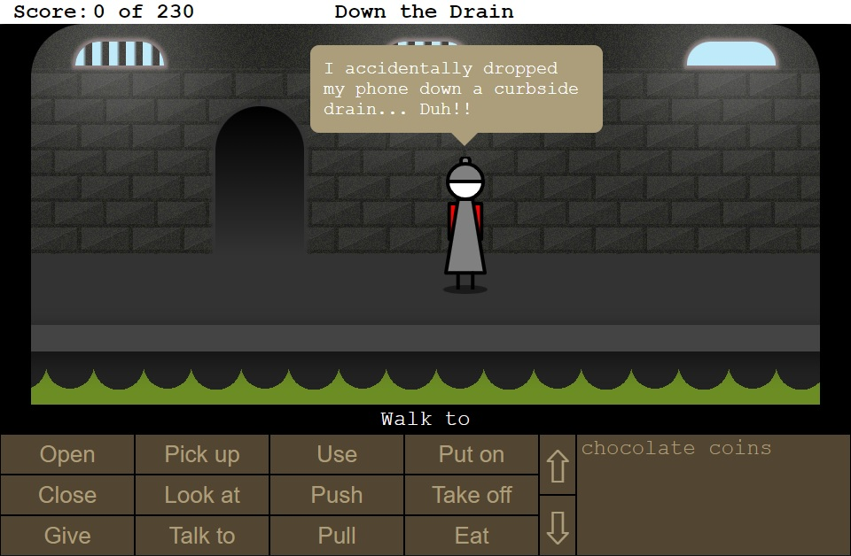

# Down the Drain
This is an an entry for js13kGames 2017. The theme for this year is "Lost", and in this case you've lost your mobile phone down the drain.

A short graphic adventure game where you guide a teenager called Pip around the underground sewers in search of Pip's phone that was accidentally dropped down a curbside drain. You'll meet some interesting characters along the way.

Classic point and click adventure interface that should be familiar to everyone.

I ran out of time in the end. I had hoped to make it much longer, and given that the ZIP is only 8324 bytes, I think there was certainly room to make this a lot bigger. Hopefully this paints a picture of the vision I had for the game. Most of my time was spent on the mechanics of the mini adventure game engine.

# Screenshots

           |  
:-------------------------:|:-------------------------:

# Credits
**Created By:** Lance Ewing  
